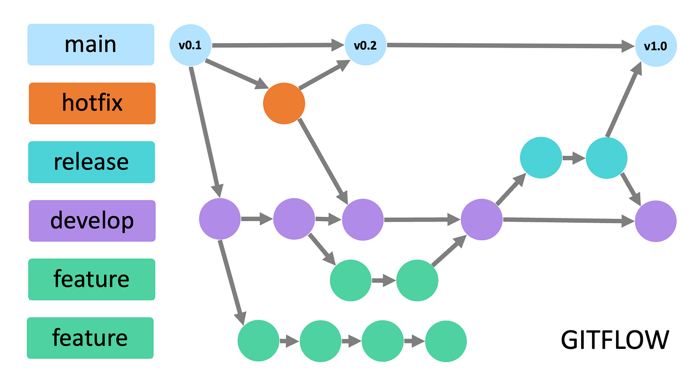
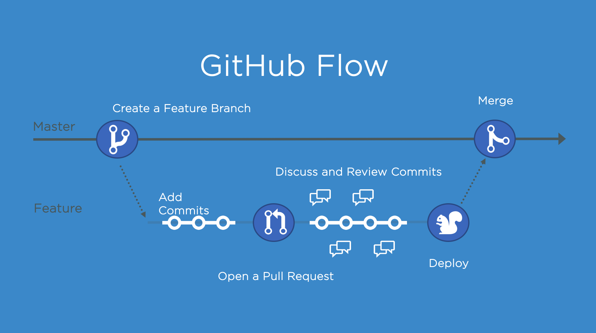
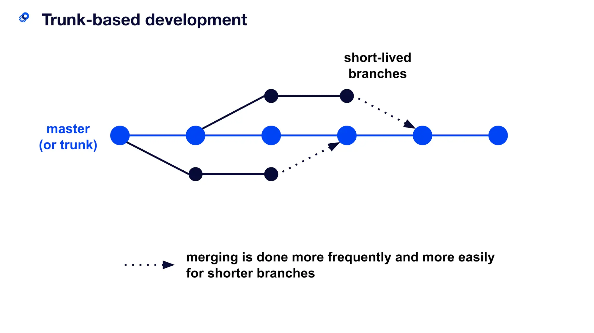
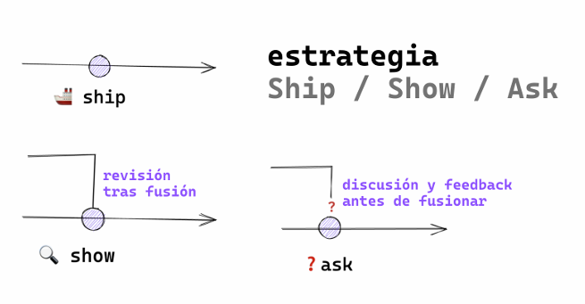

# Curso Git

## 👩🏻‍💻 Datos de la Estudiante

_**Nombre completo:** Esther Romero Aguilar_

---

## Flujos de trabajo en equipos

### Git Flow

Es un modelo de ramificación que define un flujo de trabajo para proyectos de Git. Se compone de cinco ramas:

- **Main (master)**: Contiene el código en producción.
- **Develop**: Contiene el código en desarrollo.
- **Feature**: Contiene las nuevas funcionalidades.
- **Release**: Contiene el código en preproducción.
- **Hotfix**: Contiene los parches de producción.
- **Support**: Contiene el código en mantenimiento.

### GitHub Flow

Es un modelo de ramificación que define un flujo de trabajo para proyectos de GitHub. Se compone de una rama principal:

- **Main (master)**: Contiene el código en producción.

### Trunk Based Development

Es un modelo de ramificación que define un flujo de trabajo para proyectos de Git. Se compone de una rama principal:

- **Main (master)**: Contiene el código en producción.

Es útil si contamos con un buen sistema CI/CD.

### Ship/Show/Ask

Es un modelo de ramificación que define un flujo de trabajo para proyectos de Git.

- **Ship**: Subir el código a producción.
- **Show**: Mostrar el código a los usuarios.
- **Ask**: Preguntar a los usuarios.

#### Reglas :

1. Tenemos un buen sistema de CI/CD, fiable y rápido, que hace que la rama
   principal siempre sea desplegable y que evite que lleguen errores no deseados
   a producción.
2. Confiamos en el equipo y existen buenas prácticas de desarrollo. Pair pro
   gramming, mob programming, seniority… y, sobretodo, existe responsabilidad.
   La persona se responsabiliza de decidir la categoría de su cambio. Un
   gran poder, poder hacer merge de tus propias Pull Request, conlleva una gran
   responsabilidad (no romper producción).
3. Las revisiones de código no son requerimientos para que las PRs sean fusiona
   das.
4. Las ramas son lo más pequeñas posibles, tienen un tiempo de vida corto y
   siempre salen directamente desde la rama principal.
5. El equipo ha sabido lidiar con el ego individual, las personas confían en el resto
   del equipo y las pruebas automáticas pasan. El equipo entiende que la rama
   principal puede contener código sin terminar detrás de Feature Flags u otros
   mecanismos similares
