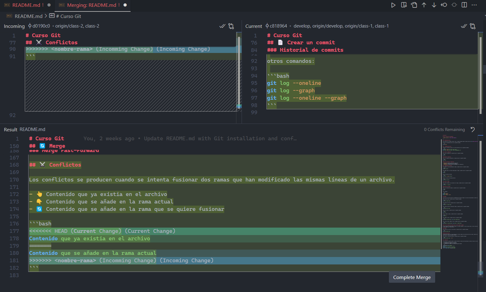

# Curso Git

## 👩🏻‍💻 Datos de la Estudiante

_**Nombre completo:** Esther Romero Aguilar_

---

## 💻 Instalación de Git

Para instalar Git en Windows, macOS o Linux, se puede descargar desde la página oficial de [Git](https://git-scm.com/).

Verificar la instalación de Git con el siguiente comando:

```bash
git --version
```

## 🛠️ Configuración de Git

Configurar el nombre de usuario y el correo electrónico con los siguientes comandos:

```bash
git config --global user.name "esther-romero"
git config --global user.email "esther.romeagui@gmail.com"
```

## 📦 Crear un repositorio

Para crear un repositorio, se puede utilizar el siguiente comando:

```bash
git init
```

### Estado del repositorio

Para ver el estado del repositorio, se puede utilizar el siguiente comando:

```bash
git status
```

### Tipos de estados del repositorio

- **Modified**: Archivos que han sido modificados.
- **Staged**: Archivos que están en el stage.
- **Committed**: Archivos que han sido guardados en el repositorio.

## 🔍 Seguimiento de archivos

Para agregar un archivo modificado al stage, se puede utilizar el siguiente comando:

```bash
git add <archivo>
```

Para agregar todos los archivos modificados al stage, se puede utilizar el siguiente comando:

```bash
git add .
```

Restaurar archivos del stage:

```bash
git restore --staged <archivo>
```

Restaurar archivos del working directory:

```bash
git restore <archivo>
```

## 📄 Crear un commit

Para crear un commit con los archivos en el stage, se puede utilizar el siguiente comando:

```bash
git commit -m "<mensaje>"
```

### Historial de commits

Para ver el historial de commits, se puede utilizar el siguiente comando:

```bash
git log
```

otros comandos:

```bash
git log --oneline
git log --graph
git log --oneline --graph
```

## 🌿 Ramas

Una rama es una línea de desarrollo independiente que permite trabajar en una nueva funcionalidad sin afectar la rama principal.

Para crear una rama, se puede utilizar el siguiente comando:

```bash
git branch <nombre-rama>
```

Para eliminar una rama, se puede utilizar el siguiente comando:

```bash
git branch -D <nombre-rama>
```

Para eliminar ramas de mi repositorio remoto, se puede utilizar el siguiente comando:

```bash
git remote prune origin
```

Para ver las ramas, se puede utilizar el siguiente comando:

```bash
git branch
```

Para ver todas las ramas, se puede utilizar el siguiente comando:

```bash
git branch -a
```

Para cambiar de rama, se puede utilizar el siguiente comando:

```bash
git checkout <nombre-rama> || git switch <nombre-rama>
```

Para crear una rama y cambiar a ella, se puede utilizar el siguiente comando:

```bash
git checkout -b <nombre-rama> || git switch -c <nombre-rama>
```

### ¿Por qué al generar una nueva rama, el id del commit no cambia?

El id del commit no cambia porque el commit es un objeto inmutable. Al crear una nueva rama, se crea un nuevo puntero que apunta al mismo commit que la rama anterior.

## 🔄 Merge

Para fusionar una rama con la rama actual, se puede utilizar el siguiente comando:

```bash
git merge <nombre-rama>
```

### Merge Fast-Forward

El merge fast-forward es un tipo de merge que se realiza cuando no hay conflictos entre las ramas. Consiste en avanzar la rama actual hasta la rama que se quiere fusionar.

Para realizar un merge fast-forward, se puede utilizar el siguiente comando:

```bash
git merge <nombre-rama>  --no-ff
```

## ⚔️ Conflictos

Los conflictos se producen cuando se intenta fusionar dos ramas que han modificado las mismas líneas de un archivo.

- 👆 Contenido que ya existia en el archivo
- 👇 Contenido que se añade en la rama actual
- 🔄 Contenido que se añade en la rama que se quiere fusionar

```bash
<<<<<<< HEAD (Current Change)
Contenido que ya existia en el archivo
=======
Contenido que se añade en la rama actual
>>>>>>> <nombre-rama> (Incomming Change)
```

ejemplo:



## 📡 Repositorios remotos

Los repositorios remotos son repositorios que están hospedados en un servidor y que servirá de punto de sincronizacion entre diferentes repositorios locales.

### 🗺️ Navegando por GitHub

- Mi perfil y repositorios:
  Avatar > Your profile
- Repositorio y ramas:
  Repositorio > Branches
- Buscar perfiles, repositorios y otros:
  Search bar
- Repositorio & Pull Requests:
  Repositorio > Pull requests
- Proyectos:
  Repositorio > Projects
- Organizations:
  Avatar > Your organizations
- Repositorio & actions:
  Repositorio > Actions
- Repositorio & Projects:
  Repositorio > Projects

### 📚 Enlazar repositorio local con remoto

Para enlazar un repositorio local con un repositorio remoto, se puede utilizar el siguiente comando:

```bash
git remote add origin <url-repositorio>
```

Para subir los cambios al repositorio remoto, se puede utilizar el siguiente comando:

```bash
git push -u origin <nombre-rama>
```

Clone un repositorio remoto mediante https:

```bash
git clone <url-repositorio>
```

Clonar un repositorio remoto mediante ssh:

```bash
git clone
```

obtener claves ssh:

```bash
ssh-keygen -t rsa -b 4096 -C
```

## 🚀 Git Push

Sube los cambios del repositorio local al repositorio remoto.

```bash
git push origin <nombre-rama>
```

### git push -u & git push -f

- **git push -u**: Establece la rama actual como rama por defecto.
- **git push -f**: Fuerza la subida de los cambios al repositorio remoto.

```bash
git push -u origin <nombre-rama>
```

```bash
git push -f origin <nombre-rama>
```

### eliminar rama remota

```bash
git push -d origin <nombre-rama>
```

### otros comandos relacionados

```bash
git push --all
git push --tags
```

## 📥 Git Pull

Descarga los cambios del repositorio remoto al repositorio local.

```bash
git pull origin <nombre-rama>
```

### git pull --rebase

El rebase es una técnica que permite reescribir la historia de un repositorio.

```bash
git pull --rebase origin <nombre-rama>
```

### git pull --all

Descarga todas las ramas del repositorio remoto al repositorio local.

```bash
git pull --all
```

### git pull --set-upstream

Establece la rama actual como rama por defecto.

```bash
git pull --set-upstream origin <nombre-rama>
```

## 🙏 Pull Request

Un pull request es una solicitud para fusionar una rama con otra rama.

### ¿Cómo se crea un pull request?

1. La rama la subiste recientemente y te aparece la opción en GitHub.
2. Vas a la pestaña Pull requests y creas uno nuevo.

### Hacer una buena PR

- **Título descriptivo**: Indica el propósito de la PR.
- **Descripción detallada**: Explica los cambios realizados.
- **Enfocar el código en una sola cosa**: Es mucho más fácil revisar y aceptar una PR que hace solo una cosa a una que hace muchas.
- **Añadir capturas de pantalla**: Si es necesario, añadir capturas de pantalla.

## Flujos de trabajo en equipos

### Git Flow

Es un modelo de ramificación que define un flujo de trabajo para proyectos de Git. Se compone de cinco ramas:

- **Main (master)**: Contiene el código en producción.
- **Develop**: Contiene el código en desarrollo.
- **Feature**: Contiene las nuevas funcionalidades.
- **Release**: Contiene el código en preproducción.
- **Hotfix**: Contiene los parches de producción.
- **Support**: Contiene el código en mantenimiento.


### GitHub Flow

Es un modelo de ramificación que define un flujo de trabajo para proyectos de GitHub. Se compone de una rama principal:

- **Main (master)**: Contiene el código en producción.


### Trunk Based Development

Es un modelo de ramificación que define un flujo de trabajo para proyectos de Git. Se compone de una rama principal:

- **Main (master)**: Contiene el código en producción.

Es útil si contamos con un buen sistema CI/CD.


### Ship/Show/Ask

Es un modelo de ramificación que define un flujo de trabajo para proyectos de Git.

- **Ship**: Subir el código a producción.
- **Show**: Mostrar el código a los usuarios.
- **Ask**: Preguntar a los usuarios.


#### Reglas :

1. Tenemos un buen sistema de CI/CD, fiable y rápido, que hace que la rama
   principal siempre sea desplegable y que evite que lleguen errores no deseados
   a producción.
2. Confiamos en el equipo y existen buenas prácticas de desarrollo. Pair pro
   gramming, mob programming, seniority… y, sobretodo, existe responsabilidad.
   La persona se responsabiliza de decidir la categoría de su cambio. Un
   gran poder, poder hacer merge de tus propias Pull Request, conlleva una gran
   responsabilidad (no romper producción).
3. Las revisiones de código no son requerimientos para que las PRs sean fusiona
   das.
4. Las ramas son lo más pequeñas posibles, tienen un tiempo de vida corto y
   siempre salen directamente desde la rama principal.
5. El equipo ha sabido lidiar con el ego individual, las personas confían en el resto
   del equipo y las pruebas automáticas pasan. El equipo entiende que la rama
   principal puede contener código sin terminar detrás de Feature Flags u otros
   mecanismos similares

## 🏆 Buenas Prácticas

### ¿Para qué sirven las buenas prácticas?

- Es un estandar manejado en la mayoría de equipos de desarrollo.
- Resolver conflictos o problemas drante el desarrollo es más sencillo.
- Tu historial de commits es más limpio y fácil de leer.

### ¿Cada cuánto tiempo debería hacer commits?

**A MENUDO**

Es mejor hacer commits pequeños, agrupando pequeñas mejoras o acciones, que un commit con todo lo que se quiere hacer.

Hacer commit a menudo no significa que debas hacer commits sin sentido.

### Escribir buenos mensajes de commit

- Usar el verbo imperativo.
  - [ADD], [FIX], [UPDATE], [REMOVE], [REFACTOR], [CHANGE]
- No usar puntos final ni puntos suspensivos en los mensajes (a lo más usa la coma)
- Usar como máximo 50 caracteres para el mensaje.
- Añadir todo el contexto que sea necesario en el cuerpo del commit (con reglas de puntuación)
- Considerar usar utilidades para hacer commit
- Usar un prefijo para los commits, cuyo fin sea hacerlos más eficientes.
  ```xml
  <tipo-de-commit> [scope] : <descripción>
  ```
  ejemplo:

```xml
  feat: add new search feature
```

### Prefijos para commits

- **feat**: Nueva funcionalidad.
- **fix**: Corrección de errores.
- **perf**: Mejora del rendimiento.
- **build**: Cambios que afectan el sistema de compilación.
- **ci**: Cambios en la integración continua.
- **docs**: Documentación.
- **refactor**: Refactorización del código.
- **style**: Cambios que no afectan el código.
- **test**: Añadir o modificar pruebas.

Ejemplo:

```xml
feat(backend): add filter for cars
fix(web): remove wrong color
```

### Escribir buenos nombres de ramas

- Ser consistente al nombrar las ramas.
- Usar el nombre de la accion que se realiza en la rama

  - bug/avoid-creating-lead-twice

## 🔙 Deshacer Cambios

### ¿En qué casos deshacemos cambios?

- Dejó de funcionar el proyecto.
- Queremos recuperar una parte del código que eliminamos.
- Queremos recuperar archivos que eliminamos.

### Comandos destrucctivos y no destructivos

#### 🔴 Destructivos

Afectan el historial de commits realizado.

#### git reset

Posee 2 opciones:

1. soft: Mantiene los cambios que ocurrieron antes de hacer commit desde donde apuntaba.

```bash
git reset --soft <id-commit> || git reset --soft HEAD~1
```

2. hard: Descarta los cambios.

```bash
git reset --hard <id-commit>
```

#### 🟢 No destructivos

Trabajan en base al historial sin afectarlo.

#### git revert

Revierte los cambios que un commit introdujo, y crea un nuevo commit con los cambios revertidos.

```bash
git revert HEAD~5
```

para abortar cambios:

```bash
git revert --abort
```

#### git checkout

Nos permite recuperar código específico de commits.

```bash
git checkout <id-commit> <archivo>
```

## Hooks, Alias y Trucos de Git

## 🔤 Hooks

Un hook, o un punto de enganche, es la posibilidad de ejecutar una accion o script cada vez que ocurre un evento en git.

#### Hooks del lado del cliente

Solo afectan al repositorio local que los contiene.

- **pre-commit**:

  - Podrias comprobar si se esta intentando hacer un commit de demasiados archivos.
  - Puede ser un buen sitio para ejecutar el linter sobre los archivos que han sido modificados

- **prepare-commit-msg**:
  - Para modificar el mensaje del commit o añadir cualquier información extra.
- **commit-msg**:

  - Es el sitio perfecto para hacer todas las comprobaciones pertinentes al mensaje.

- **post-commit**:
  - Su uso principal es la de notificar por Slack.
- **pre-push**:

  - Para ejecutar una bateria de tests.

- **post-checkout y post-merge**:
  - Permite limpiar el directorio de trabajo, tras realizar un checkout, o el de limpiar las ramas que ya no se usan tras realizar un merge.

### Desventajas de los Hooks del lado del cliente

Los hooks no se comparten con el repositorio, por lo que si alguien clona el repositorio no tendrá los hooks.

#### Hooks del lado del servidor

Es interesante conocerlos ya que páginas como GitHub o GitLab lo usan intesamente a la hora de construir.

- **pre-receive**:

  - Para comprobar que los commits que se quieren guardar están bien formados.
  - Verificar que el usuario que intenta grabar los commits tiene permisos necesarios para hacerlo.

- **update**:

  - Puedes evitar de una forma granular cada actualización.

- **post-receive**:
  - Enviar un correo a todos los usuarios del repositorio que se han grabado nuevos cambios en el repositorio remoto.
  - Reflejar en una UI las nuevas referencias, ramas o commits disponibles.

### Crear Hook

Para crear un hook, simplemente debemos crear un archivo en la carpeta `.git/hooks` con el nombre del hook que queremos crear.

## 🎭 Alias

Los alias permiten definir una serie de comandos que pueden ser usados en lugar de los nombres completos.

```bash
git co -> git commit
git st -> git status
```

#### ¿Por qué origin es un alias?

Porque origin es el nombre por defecto que se le da al repositorio remoto.

#### Crear Alias

```bash
git config --global alias.co commit
```

```bash
git config --global alias.wo "log --oneline"
```

#### Borrar Alias

```bash
git config --global --unset alias.co
```

## 🎩 Trucos en Git

### Guarda cambios temporalmente

```bash
git stash
git stash -u
git stash pop
```

### Aplicar cambios de commits en específico

```bash
git cherry-pick <commit>
```

### Detectar que commit es el que ha introducido un gub

```bash
git bisect
git bisect start
git bisect bad
git bisect good <commit>
git bisect reset
```

### Cambiar el nombre de un commit

```bash
git commit --amend -m <descripcion>
```

### Recuperar un archivo en concreto de otra rama o commit

```bash
git checkout <SHA> <archivo-e>
```
